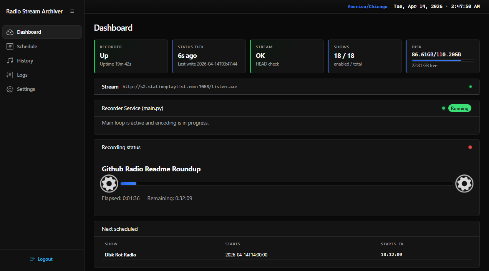
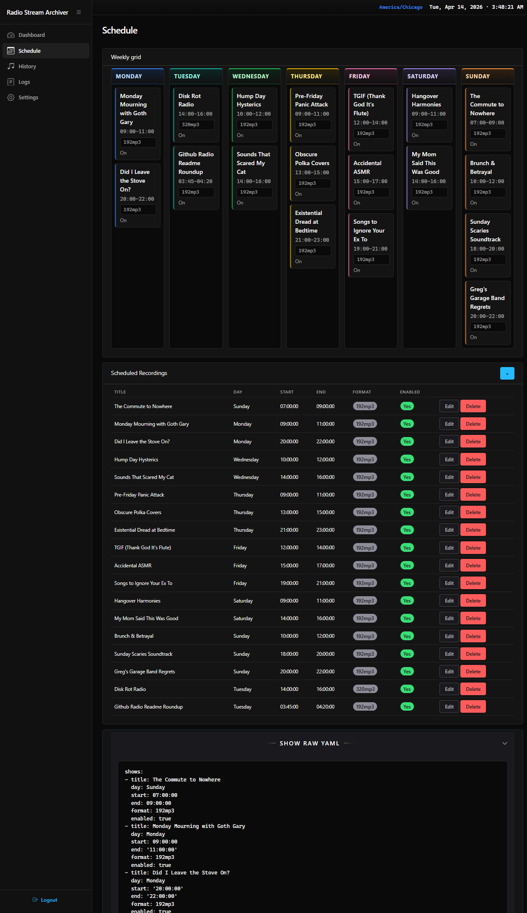

## Radio Archive (`radioarchive`)

`radioarchive` is a small Python app that **records scheduled radio shows from a stream URL** using `ffmpeg`.

It’s designed to be simple to operate:

- **One YAML file** (`schedule.yaml`) controls the schedule and settings
- An optional **web UI** lets you manage the schedule and browse recordings (separate process)

## Requirements

- **Python 3.10+**
- **ffmpeg** available on PATH (or set `ffmpeg_path` in `schedule.yaml`)

Python dependencies:

- `pyyaml`
- `flask`
- `mutagen` (web UI duration estimates for MP3)

## Quickstart

From the `radioarchive/` directory:

```bash
python -m venv .venv
```

Activate the venv:

- **Windows (PowerShell)**:

```powershell
.\.venv\Scripts\Activate.ps1
```

- **Linux/macOS (bash/zsh)**:

```bash
source .venv/bin/activate
```

Install dependencies:

```bash
pip install -r requirements.txt
```

Create your config:

```bash
cp schedule.example.yaml schedule.yaml
```

Then edit `schedule.yaml` (stream URL, output folder, shows, and optionally web UI credentials).

## Installing ffmpeg

### Windows

Using `winget`:

```powershell
winget install Gyan.FFmpeg
```

Or download a build and set `ffmpeg_path` in `schedule.yaml` (example: `C:/ffmpeg/bin/ffmpeg.exe`).

### Linux (Ubuntu/Debian)

```bash
sudo apt update
sudo apt install -y ffmpeg
```

## Running

### Recorder (scheduler + recording loop)

From the `radioarchive/` directory:

```bash
python main.py
```

It writes:

- **Logs**: stdout and `radioarchive.log` (rotating, 5MB max, 3 backups)
- **Status**: `status.json` (updated on each scheduler tick)

The recorder:

- Reloads `schedule.yaml` when the file changes (no restart required)
- Starts recording **`stream_preroll_seconds`** early (optional)
- Restarts `ffmpeg` if it exits early (writes parts, then stitches them on stop)

### Web management UI (optional, separate process)

The web UI is a separate Flask process. It does **not** import the recorder; it reads files written by the recorder.

To enable it, your `schedule.yaml` must include a `web:` block (username/password/port/secret_key).

Run:

```bash
python web/app.py
```

Then open `http://localhost:<web.port>` and log in.

## Configuration (`schedule.yaml`)

Start from `schedule.example.yaml`.

Top-level keys:

- **`stream_url`** (required): stream URL used for all recordings
- **`output_root`** (required): directory where recordings are written (relative paths are relative to the app directory)
- **`ffmpeg_path`** (optional): defaults to `ffmpeg`
- **`stream_preroll_seconds`** (optional): integer \(0–600\), default `0`
- **`shows`** (required): list of scheduled shows (can be empty)
- **`web`** (optional): only required if you run the web UI

Example:

```yaml
stream_url: "http://example.com:8000/stream.aac"
output_root: "recordings"
ffmpeg_path: "ffmpeg"
stream_preroll_seconds: 0
web:
  username: "admin"
  password: "change-me"
  port: 8080
  secret_key: "replace-this-with-a-random-string"
shows: []
```

### `web` block (web UI login)

If you run `python web/app.py`, the `web:` block is required:

- **`username`** / **`password`**: single shared login (Flask session)
- **`port`**: TCP port
- **`secret_key`**: cookie signing secret (generate a long random string)

### Show entries

Each entry in `shows:` supports:

- **`title`** (required): used as the show folder name (sanitized for Windows + Linux)
- **`day`** (required): `Monday` … `Sunday`
- **`start`** / **`end`** (required): `HH:MM:SS` local time (same-day only; cross-midnight is rejected)
- **`format`** (required): `192mp3`, `320mp3`, or `wav`
- **`enabled`** (optional): boolean, default `true`
- **`end_date`** (optional): `YYYY-MM-DD` (exclusive upper bound; no starts on/after this date)
- **`stream_url`** (optional): accepted for future use but **not implemented** yet (global `stream_url` is used)

```yaml
shows:
- title: Peter Framptons Jamacian Vacation
  day: Tuesday
  start: '14:00:00'
  end: '16:00:00'
  format: 320mp3
  enabled: true
```

### Notes when editing via the web UI

- **Saving from the UI rewrites `schedule.yaml`** using PyYAML.
- **YAML comments are not preserved** when saving from the UI.

## Output layout

Final recordings are written under:

`{output_root}/{show_title}/YYYY-MM-DD_HH-MM-SS.{ext}`

Example:

`recordings/Supersonic Radio Show/2026-04-15_14-00-00.mp3`

During reconnects, temporary parts are written to:

`.../YYYY-MM-DD_HH-MM-SS.{ext}.parts/part0001...`

## Web UI pages

- **Dashboard**: live status from `status.json`


- **Schedule**: add/edit/delete shows and view raw YAML



- **History**: scan `output_root` for recordings; play/download files
- **Logs**: tail of `radioarchive.log`
- **Settings**: edit global settings and run “Measure stream preroll”

## Security / safety notes

- **Don’t commit `schedule.yaml`** if it contains real credentials or local paths. Keep it private.
- If exposing the web UI beyond localhost, **set a strong `web.secret_key`** and choose a strong password.

## Troubleshooting

- **Dashboard shows recorder stopped**: ensure `python main.py` is running and `status.json` is being updated.
- **`ffmpeg not found`**: install `ffmpeg` and ensure it’s on PATH, or set `ffmpeg_path` in `schedule.yaml`.
- **Schedule edits not taking effect**: if `schedule.yaml` is invalid YAML, the recorder keeps the last known-good config and logs the error.
